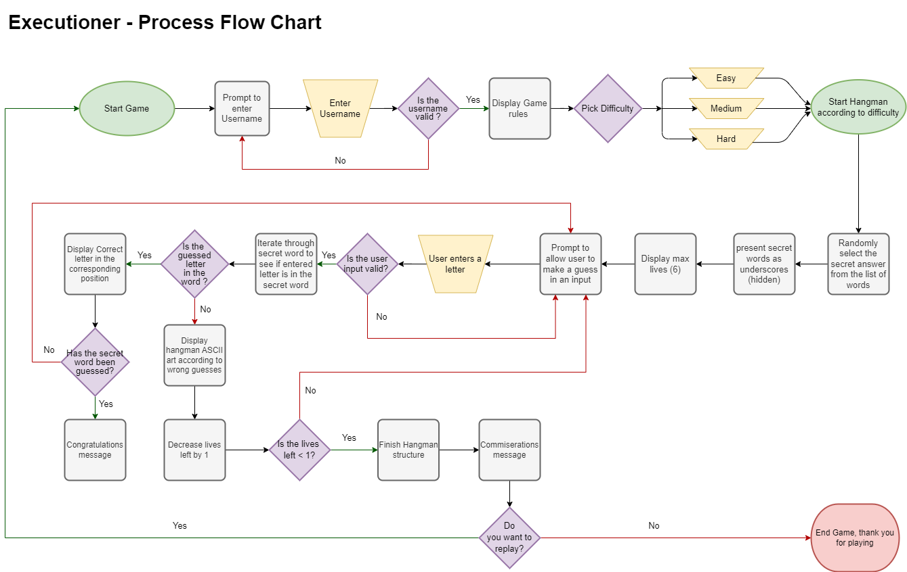
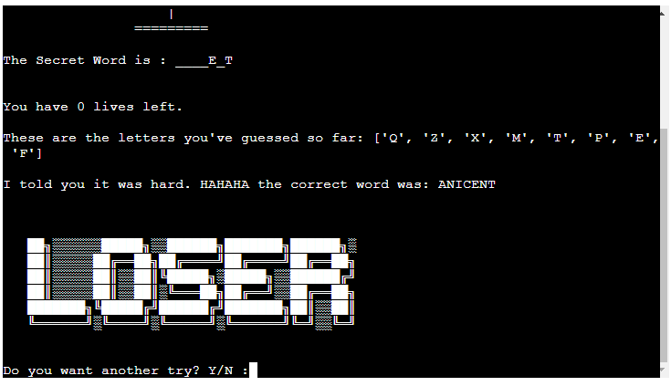

# Executioner

## Introduction

Welcome to Executioner, a hangman game with 3 difficulties based on words relating to the pre-19th century when executions were all the craze!. The game is a text-based python game that is ran on a mock terminal in Heroku. The user has to guess the secret word before 6 lives run out and the man is hanged. 

### How to play

The game is pretty simple so there's not too much to it
* Enter your username
* Pick a difficulty.
* Guess a letter, if the letter is uncovered you have guessed correctly, if not you have lost a life!
* Guess incorrectly 6 times and that's it GAME OVER!
* Guess the word correctly and you can add some chicken to your dinner because: WINNER WINNER, CHICKEN DINNER!

---

## Table of contents

  * [UX (user experience)](#ux--user-experience-)
    + [Goals](#goals)
    + [User's Stories](#user-s-stories)
    + [Site Owner's Goals](#site-owner-s-goals)
    + [Expectation](#expectation)
    + [Requirements](#requirements)
  * [Design](#design)
    + [Logo](#logo)
    + [Hangman Drawing](#hangman-drawing)
    + [Flow Charts](#flow-charts)
  * [Features](#features)
    + [Current Features](#current-features)
      - [Initial Screen](#initial-screen)
      - [Username Prompt](#username-prompt)
        * [Username Prompt Validation](#username-prompt-validation)
      - [Instructions Prompt](#instructions-prompt)
        * [Instructions Prompt Validation](#instructions-prompt-validation)
      - [Difficulty Prompt](#difficulty-prompt)
        * [Difficulty Prompt Validation](#difficulty-prompt-validation)
      - [Game Screen](#game-screen)
        * [Game Screen Validation](#game-screen-validation)
      - [End Screen](#end-screen)
        * [End Screen Validation](#end-screen-validation)
    + [Future Implementations](#future-implementations)
  * [Bug Fixes](#bug-fixes)
    + [Unfixed Bugs](#unfixed-bugs)
  * [Technologies used](#technologies-used)
    + [Langugages](#langugages)
    + [Tools](#tools)
  * [Testing](#testing)
    + [Testing group feedback](#testing-group-feedback)
    + [Functionality Testing](#functionality-testing)
    + [PEP8 Linter Testing](#pep8-linter-testing)
      - [run.py](#runpy)
      - [main.py](#mainpy)
      - [utility.py](#utilitypy)
      - [words.py](#wordspy)
  * [Concluding statements](#concluding-statements)
  * [Deployments](#deployments)
    + [Pre-requisite requirements](#pre-requisite-requirements)
      - [Optional step (if required)](#optional-step--if-required-)
    + [Heroku](#heroku)
  * [Development](#development)
    + [Forking](#forking)
    + [Cloning](#cloning)
    + [Local Development](#local-development)
  * [Credits](#credits)

---

## UX (user experience)

### Goals

* 3 levels of difficulty, the harder the difficulty the more letters there are to guess. 
* Numerically track the amount of lives left in the game.
* Interactive input requirement for the user with validation.
* Feedback for success or failure.
* Clear instructions displayed.
* Have a sarcastic narrator tone throughout the game.

### User's Stories

* As a user, I want to be able to select a difficulty I require. 
* As a user, I expect the underscores of the hidden word is the same length as the secret word. 
* As a user, I want to have feedback if the same letter has already been guessed
* As a user, I want an underscore to convert to the guessed letter if the guessed letter is contained in the secret word. 
* As a user, I want to see the man hanged when all lives are lost. 
* As a user, I want the user to be interacted by the comedic sarcastic narrator tone.

### Site Owner's Goals

* If an invalid input is entered e.g. 1, 2, 3 etc. validation is required to inform the user to enter a valid input. 
* Feedback should be presented to the user, when a correct or incorrect letter is entered. 
* When lives are lost a progressional display must be present leading to the final hanged man when all lives are lost.
* The user can replay the game at different or a the same difficulty upon completion. 

### Expectation

* I expect feedback to be visible when inputted by the user.
* I expect all input to have validation to make sure the user can only enter the required input. 
* I expect the user to be able to enter a username and have feedback associated to the feedback. 
* I expect text to be spaces and formatted in a modern format. 

### Requirements

* Validation is required for all user inputs.
* Difficulty must be able to be selected by selecting E, M or H for (easy, medium or hard respectively)
* All secret answers must be related to the pre-19th century theme. 
* Lives remaining must be presented after each guess.

---

## Design

### Logo

The logo was designed using [ASCII](https://en.wikipedia.org/wiki/ASCII_art "ASCII") text generator [fsymbols](https://fsymbols.com/generators/carty/ "fsymbols"). This offers the user a bold enterance to the game and stands out as the first thing you see. This text generator and font style will be used for all main texts, such as game over and congratulations. 

### Hangman Drawing

The [ASCII](https://en.wikipedia.org/wiki/ASCII_art "ASCII") art used for the hangman generation was inspired by [Hangman Art](https://gist.github.com/chrishorton/8510732aa9a80a03c829b09f12e20d9c "Hangman Art"). This drawing required updating for the format used within the game. The aim of the hangman drawing is simple, if a letter is guessed incorrectly, the hangman process is progressed, otherwise it will stay constant.

### Flow Charts

The below flow charts show the process that is to be followed in the development of the application. The flow chart was created using [draw.io](https://app.diagrams.net/ "draw.io"). The validation required at each input point is added to make sure that the game is reactive to all possible outcomes. 

---

## Features

### Current Features

#### Initial Screen
The initial feature observed by the user is the title: Executioner, a fast typewriter effect is given to the title which offers a fun experience to the user and allows them to know that they are going to be playing a game. Secondly, a slower typewriter effect input statement is present whereby, the user is prompted to enter a name. 

#### Username Prompt
The username input prohibits the user to enter a name that is purely alphabetical and also stops the user entering nothing. The invalid entry error message is shown below. Furthermore if a valid entry is inputted by the user, then the next step of the game, which is asking the user if they would like to read instructions. 

##### Username Prompt Validation

#### Instructions Prompt

After successfully adding a username, the user is prompted to answer the question of `Do you want to read the instructions? Y/N?`. The validation provided for this function only allows the user to answer with a **Y** or an **N**. If either of those answers are not entered, an error is shown and the user is prompted again to answer the question. If the user answers with a **Y**, the instructions of the game are provided, if they answer with an **N**, the user goes onto the next step of the game. 

##### Instructions Prompt Validation

#### Difficulty Prompt

The next step of the game is the ask the user what level of difficulty they would like to play at. The length of the secret word to guess will increase relatively according to what difficulty is selected. (e.g easy, will be words like BELL and hard would be words like GUILLOTINE) There is also validation to this input by only allowing the user to select **E**, **M** or **H**, as shown in the screenshots below:

##### Difficulty Prompt Validation

#### Game Screen

The game screen compromises of multiple variables that the user requires to be able to play game whilst being UX friendly. As typically observed in hangman, a visible and transitional hanging of a man is presented. Other features presented ara:
* The secret word that the user has to guess is presented as underscores, which updates if the letter guessed is in the secret word.
* If the letter guessed is not in the secret word, a randomly chosen putdown is presented to the user. This improves the overall interactibility of the game as well as the user interphase. 
* The number of lives left for the user is also presented, this added with the hangman progression allows the user to know how much of the game is remaining. If the user guesses an incorrect letter, the number of lives go down. 
* All letters guessed by the user is also presented to the user, so they are aware of letters guessed. This helps the user from guessing the same letter again.
* An input is presented to the user to enter a letter as a guess to check if it is in the secret word. This letter is fed through to all the other variables within the game screen.
* Finally, validation is provided to the user to stop them from entering in an invalid response and the input is offered again.

##### Game Screen Validation

#### End Screen

The end screen is one of the final aspects that the user will meet before the game is finished. The end screen offers two outcomes, either the user is successful or unsuccessful. If the user guesses the word correctly, the user is met with a message and a custom font **WINNER**. If the user does not guess the word within the number of lives (6) the user is met with another message and the custom font stating **LOSER**. 

The Final feature of the game is a question to ask the user if wants to retry the game. If a user would like to retry, they enter **Y** and the game is restarted. If the user does not, they are greeted with an animated message saying goodbye and an option to press run programme if they do want to restart the game after the game is finished. Moreover, as seen throughout the game, validation is added to make sure the valid responses are limited to **Y** or **N** and if neither of those entries are added, the user is greeted with an error message. 

##### End Screen Validation

### Future Implementations

* In the future, given more time I would like to improve adding designs and colour to the webpage, this would entice a user to stay on the page and recommend the page to others.
* With more time and resources, I would like to implement a feature to share scores with others on social media.
* With more time and resources, I would like to add a hint function to each word for user's who require additional help. 

---

## Bug Fixes

| Bug detected | Action |
|--|--|
|When testing the game, for any input, if a lowercase letter was added, the function would not conduct correctly. |The validation was fixed by adding an `.upper()`to all inputs. This meant that all inputs would be converted to uppercase automatically.  |
|When moving functions into different files for best practise, `pylint` errors were raised or `ModuleNotFoundError` were presented |The issue was attempting a relative import outside of the top level package. The solution was to pop an `__init__.py` file in the directory. This recognised the linking folders as a package. For more information on this, click [here](https://careerkarma.com/blog/python-beyond-top-level-package-error-in-relative-import/ "Career Karma") |
|When prompted to enter the username, it was observed that if nothing was entered, the programme would continue with no username|A fix found for this was to use `raise ValueError` which made sure that the username had to only contain alphabetical and had to be atleast 1 letter.|
|During testing the draw hangman function would present the pole of the hanging station to mis-align and not be straight on console.|The error was caused by the additional `\`, to fix this I added another space bar to the hangman drawings affected and the pole was straight on console.|

### Unfixed Bugs

A bug that was discovered during the testing phase by my team was that when the typewriter style printing functions were ran, pressing mutliple buttons or enter numerous times would keep looping some functions. As this is a bug I could not fix due to time constraints, I added an instruction to tell the user to wait for all the text to load before typing in a response. 

---

## Technologies used

### Langugages

* HTML - supplied by code institute template
* CSS - supplied by code institute template
* JavaScript - supplied by code institute template
* [Python](https://www.python.org/ "Python")

### Tools

* [draw.io](https://app.diagrams.net/ "draw.io")
* [Heroku](https://www.heroku.com/ "Heroku")
* [Git](https://git-scm.com/ "Git")
* [GitHub](https://github.com/ "GitHub")
* [GitPod](https://www.gitpod.io/ "GitPod")
* [fsymbols](https://fsymbols.com/generators/carty/ "fsymbols")
* [AmIResponsive](https://ui.dev/amiresponsive "AmIResponsive")
* [Python Linter](https://pep8ci.herokuapp.com/ "Python Linter")

---

## Testing

### Testing group feedback

| Testing Age Range |Constructive Feedback| Implemented? |
|--|--|--|
|14 - 18|Rather than just plain text, make the title a cooler font style|Yes|
|24 - 30|Show the letters that have already been guessed|Yes|
|24 - 30|Instead of having to always read the instructions, offer an option to skip the instructions.|Yes|
|24 - 30|Even though the hangman structure is progressing, add a record of lives remaining.|Yes|
|31 - 40|Clear the screen with each guess and the function must be compatible to both windows and mac|Yes|
|60 - 65|None, enjoyed the game and was simple |N/A|

### Functionality Testing

|Test|Outcome| Pass or Fail |
|--|--|--|
|Entering an invalid input to the input including empty, numbers or symbols to username prompt function|Error thrown stating "Your name must contain letters only and atleast 1 character"| Pass|
|Add conforming input to username|Name recorded and used to form returned statement| Pass|
|Add conforming input to username|Prompt to ask user if they want to read the instructions| Pass|
|Entering an invalid input to the input including empty, numbers or symbols to rules prompt function|Error thrown stating “Very simple, Y or N...”| Pass|
|Entering "Y" in upper and lowercase to the rules prompt function|instructions printed| Pass|
|Entering "N" in upper and lowercase to the rules prompt function|Difficulty level function initiated| Pass|
|Entering an invalid input to the input including empty, numbers or symbols to Difficulty selector function|Error thrown stating "clearly, that was too many instructions for you, enter a valid letter"|Pass|
|Entering "E" in upper and lowercase to the difficulty selector function|Game started with an easy word| Pass|
|Entering "M" in upper and lowercase to the difficulty selector function|Game started with a medium word| Pass|
|Entering "H" in upper and lowercase to the difficulty selector function|Game started with a hard word| Pass|
|Entering an invalid input to the input including empty, numbers, repeated letters or symbols when prompted to guess a letter|Error thrown stating "The instructions must've been too hard to follow... guess one valid alphabetical character"|Pass|
|Entering a correct letter into the game|letter printed in the correct location, even when the same letter appears twice| Pass|
|Entering a correct letter into the game|Feedback given to the user stating "Lucky guess, `{letter}` is in the secret word| Pass|
|Entering an incorrect letter into the game|random Putdown generated and presented to the user | Pass|
|Entering any letter into the game|letter is added to the letters guessed section and printed on console | Pass|
|Correctly guessing the secret word|"WINNER" printed in the style of the logo| Pass|
|Correctly guessing the secret word|Feedback given stating "...I didn't expect that to happen, you're not as dumb as you look. Well done" | Pass|
|Incorrectly guessing the secret word|"loser" printed in the style of the logo| Pass|
|Incorrectly guessing the secret word|Feedback given stating "I told you it was hard. HAHAHA the correct word was: `{word}`| Pass|
|Completing all guesses|Replay of game offered to the user| Pass|
|Entering an invalid input to the input including empty, numbers or symbols asked if they want to retry|Error thrown stating "Simple instructions, Y or N...| Pass|
|Entering "Y" to retry option|Game restarted| Pass|
|Entering "N" to retry option|Goodbye printed in logo styling, with an additional comment to press run programme to retry at a later time.| Pass|

### PEP8 Linter Testing

As no extra additions were done to the HTML, CSS or JS files, validation checks were not performed. However, as all the code is written in python, all code was entered into [Python Linter](https://pep8ci.herokuapp.com/ "Python Linter"). The `__init__.py` file does not contain any content and therefore was not required to be tested.

#### run.py

#### main.py

#### utility.py

#### words.py

---

## Concluding statements

In conclusion, I am very proud of what I have built. Throughout the project, there were multiple errors I ran across which took a lot of time to fix, but it was worth it. The game I designed handles all invalid inputs, provides feedback to the user and replicates a classical game that is known by everyone around the globe. The game is intuitive and easy to use. My parents who are the least tech-savvy people I know, was able to play the game without any further instructions. Overall, the **requirements** of the game, such as the **goals**, **User stories**, **Site Owner's Goals** and **Expectations** have been met sufficiently. 

---

## Deployments

As a pure python code can only be displayed on a terminal of your own machine or within gitpod, the code-institute python essentials template is to be used on the workspace so that it can later be deployed to [Heroku](https://www.heroku.com/  "Heroku") for user accessibility.

### Pre-requisite requirements

* add `\n` (newline) character for all inputs to your code.

#### Optional step (if required)

* If for the function of the game, dependancies are required, then all dependancies are to be transferred to **requirements.txt** by typing the following command into the terminal:

>  pip3 freeze > requirements.txt

### Heroku

* **Log in** to your [Heroku](https://www.heroku.com/  "Heroku") account or **sign up** if it's your first time.
* Activate the Heroku Student Pack as per the instructions on the **Deployments module** in the Love Sandwiches project.
* On the home page, click the **Create new app** button.
* Write an **App name** that is unique, the input bar validation will guide you if the app name has been used before or is available.
* Select the **region** that corresponds to where you are situated.
* Click the **Create app** button
* Click on the **settings** tab and click on **config vars** button.
*  Add a Config var with a key of `PORT` and a value of `8000`.
* If there are any sensative information required for the app to function such as emails, this is to be stored in a **.json** file and also added to the **config vars**. 
* Add  **buildpacks** , by clicking **Add buildback** and click on **python** and click **save changes**. 
* Add another buildback and click on **node.js** and click save changes. The order must be **Python** then **node.js**.
*  Click on the **Deploy** section and in the deployment method click on **GitHub**.
* Search for the **respository** to be deployed and click **connect**.
* Scroll further down and in the automatic deploy section, click the **Enable Automatic Deploys** so that for every push from GitHub, the app is automatically updated. 
* Finally click on **Deploy Branch** to deploy the application. 
* Once the application is deployed, click on the **view** button to see the programme running. 

## Development

### Forking

If you would like to fork any repositories, follow the steps below:
* Log in to **GitHub**.
* Navigate to the [Executioner Repository](https://github.com/AlexAntony3/executioner  "Executioner Repository"). 
* At the top of the page, locate the **fork** icon

* Click on the **downward** icon next to fork and press **create a new fork**.
* Select an **owner** for the repository
* **Change** the name of the repository if required
* Choose whether to **copy** all branches or just the `default` branch. 
* Click the Create Fork button and you have forked my repository.

### Cloning

If you would like to clone any repositories, follow the steps below:
* Log in to **GitHub**
* Access the required repository or my repository by clicking the following link: [Executioner Repository](https://github.com/AlexAntony3/executioner  "Executioner Repository")
* Click on the `<> Code` button.
* In the **local** tab, select the **HTTPS** button and copy the URL.
* Open up a new workspace
* Use the `git clone` command In the command line of the workspace, paste in the copied URL. It should look like this:
> git clone https://github.com/YOURUSERNAME/YOURREPOSITORY
* Press **Enter** and the repository will be cloned!.

### Local Development

* After forking the repository, follow the cloning method to continue with development.
* To run the programme on your development tool, make sure you have atleast version **3.8+** of python installed. 
* To run the code on the development tool, type in the following to the terminal:
> python3 run.py

---

## Credits

* [Simen Daehlin](https://www.linkedin.com/in/simendaehlin/ "Simen Daehlin") - Assistance throughout the project
* My testing team, this was a team of my colleagues, friends and family. - Thank you for all the rigerous testing and feedback.
* [Kite](https://www.youtube.com/watch?v=m4nEnsavl6w&ab_channel=Kite "Kite") - Example and inspirations of the hangman game. 
